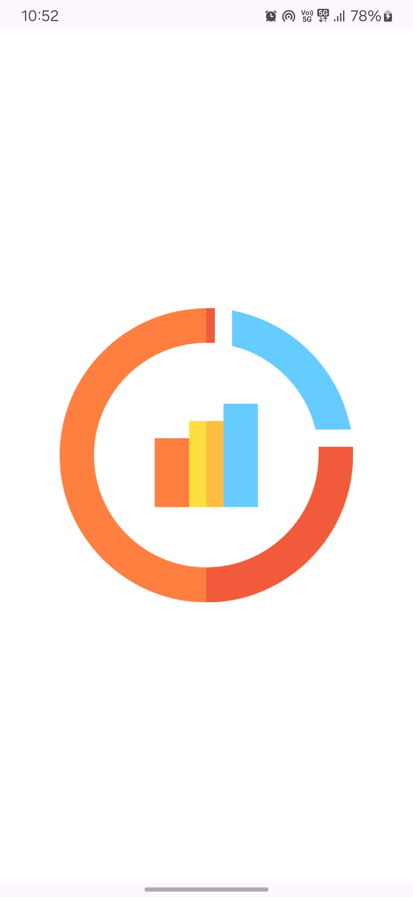
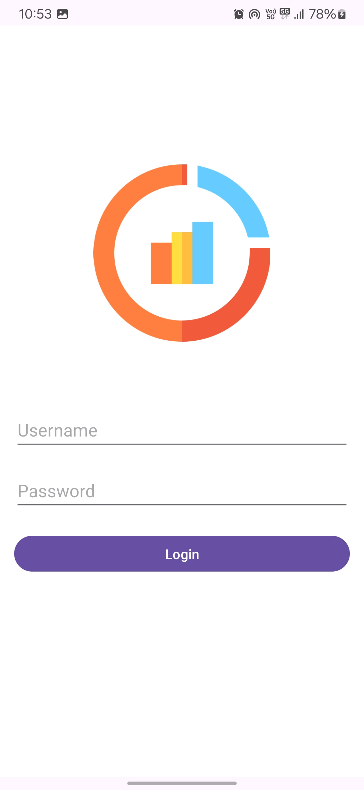
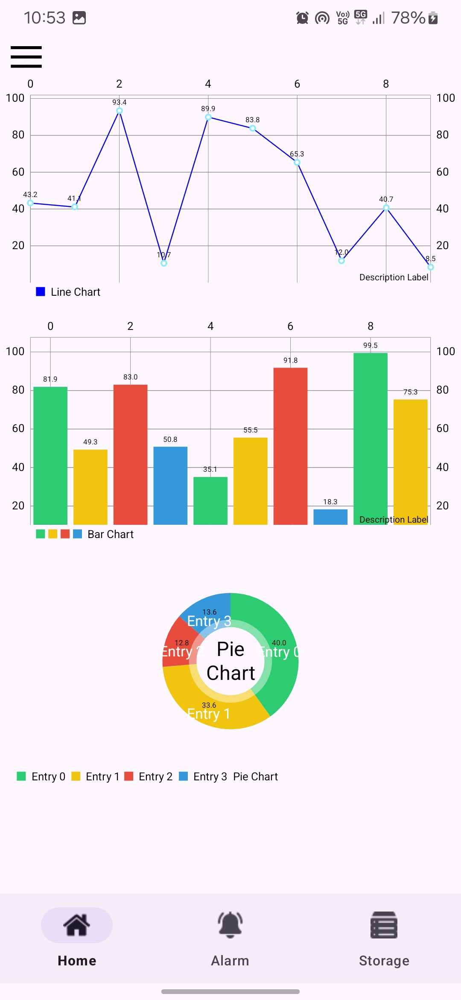
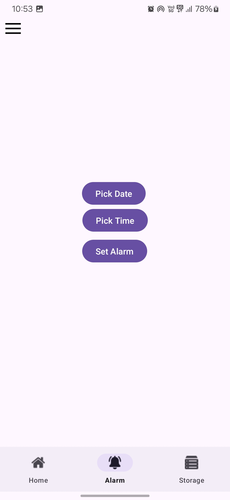
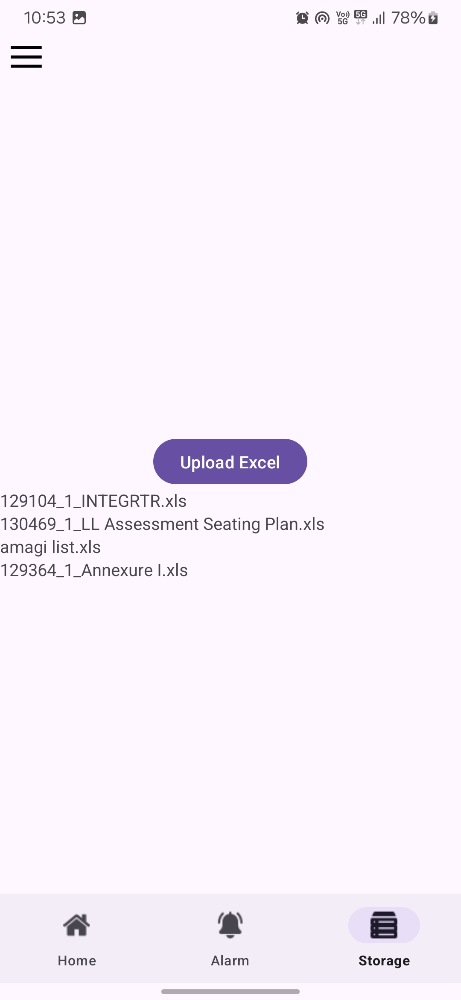

# Data_Visuals Application

Data_Visuals is a comprehensive Android application designed to provide users with powerful data visualization tools, secure authentication mechanisms, and seamless navigation features. From dynamic chart views to secure data storage solutions, the app offers a range of functionalities to meet diverse user needs.

## Features

### Splash Screen
- Engaging splash screen with a captivating design to create a memorable first impression.

### Login Page
- Intuitive login page for secure user authentication, ensuring access control to app features and data.

### Chart Views
- Line Chart: Visualize trends and patterns in data with interactive line charts.
- Bar Chart: Compare data across categories using dynamic bar charts.
- Pie Chart: Represent data composition and proportions with colorful pie charts.

### Bottom Navigation
- Streamlined navigation with a bottom navigation bar for easy access to app sections.

### View Pager
- Interactive view pager for seamless navigation between multiple fragments or screens within the app.

### Fragments
- Modular design with fragments to facilitate code organization and reuse, ensuring maintainability and scalability.

### Internal Storage
- Securely store user credentials (username and password) in internal storage for seamless authentication.

### External Storage
- Import Excel files from external storage for data analysis and visualization within the app.

### Alarm Manager
- Schedule and manage alarms for timely reminders and notifications.

### Top App Bar with Side Bar
- Top app bar with a side drawer for quick access to app settings and navigation options.

## Screenshots

    
    
    
    
    

## Usage

1. Clone the repository.
2. Open the project in Android Studio.
3. Build and run the app on an Android device or emulator.

## Contributing

Contributions are welcome! Feel free to open an issue or submit a pull request for any enhancements or bug fixes.

## License

This project is licensed under the [MIT License](LICENSE).
